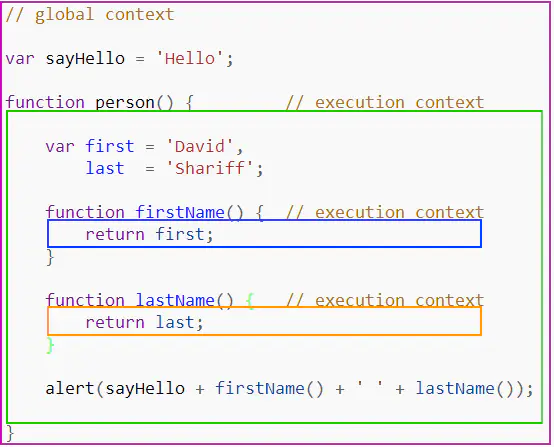

## 执行上下文栈

### 什么是执行上下文栈

  当JavaScript代码运行的时候，确定它运行所在的环境是非常重要的。

1. 全局执行上下文 – 这个是默认的代码运行环境，一旦代码被载入，js引擎最先进入的就是这个环境 

    全局执行环境可以看成是浏览器里面的`script`标签,一个页面的多个`script`会构成一个全局执行环境 
<!--more-->
2. 函数执行上下文 – 当执行一个函数时，运行函数体中的代码 

 其实，主要就是全局执行上下文和函数执行上下文。下面举一个简单的例子： 



>  在上图中，我们有1个全局上下文(Global Context)，使用紫色边框表示；有3个不同的函数上下文(Function Context)由绿色，蓝色，和橙色边框表示。注意！全局上下文有且只有一个，程序中其他任意的上下文都可以访问全局上下文。

 你可以拥有任意数量的函数上下文。每一次**函数调用**都会创建一个新的上下文，它会创建一个私有域，函数内部做出的所有声明都会放在这个私有域中，并且这些声明在当前函数作用域外无法直接访问。在上面的例子中，一个函数可以访问它所在的上下文尾部的变量，但是一个外部的上下文无法访问内部函数内部声明的变量/函数。为什么会发生这样的情况？代码究竟是如何被解析的呢？

------


### 执行上下文栈

  浏览器中的JS解释器是单线程的。也就是说在浏览器中同一时间只能做一个事情，其他的action和event都会被排队放入到执行栈中(Execution Stack)。下图表示了一个单线程栈的抽象视图 

  

如我们所知，当一个浏览器第一次load你的代码的时候，首先它会进入到一个全局执行上下文中。如果在你的全局代码中，你调用了一个函数，那么程序的执行流程会进入到被调用的函数中，并创建一个新的执行上下文，并将这个上下文推入到执行栈顶。

如果在当前的函数中，你又调用了一个函数，那么也会执行同样的操作。执行流程计入到刚被调用的函数内部，重新创建一个新的执行上下文，并再次推入到执行栈顶。浏览器会一直执行当前栈顶的执行上下文，一旦函数执行完毕，该上下文就会被推出执行栈。下面的例子展示了一个递归函数以及该程序的执行栈：

```jsx
(function foo(i) {
  if (i === 3) {
    return;
  }
  else {
    foo(++i);
  }
}(0));
```

 

 这个代码循环调用了三次，每次对i累加1。每次函数foo调用的时候，都会有一个创建新的执行上下文。一旦上下文完成了执行，就会推出栈，将控制流返回给它下面的执行上下文，这样一直到全局上下文。 

------


### 执行上下文详解

 我们已经知道每当一个函数调用发生，都会创建一个新的执行上下文。但是在JS解释器内部，每次调用一个执行上下文都分为两个步骤 

1. **创建阶段**[在函数被调用，但还未执行任何代码之前]

   - 创建[作用域链].

   - 创建变量，函数和参数

   - 决定[`"this"`]的值

     

2. **激活/代码执行阶段**：

   - 分配变量，以及到函数的引用，然后解析/执行代码
    一个执行上下文从概念上可以视为一个包含三个property的Object 
```javascript
executionContextObj = {
    'scopeChain': { /* 可变对象 + 所有父执行上下文的可变对象 */ },
    'variableObject': { /* 函数参数、内部变量和函数声明*/ },
    'this': {}
}
```

------


### 建立阶段

当调用函数的时候，就会创建`executionContextObj`对象，此时真正的函数逻辑还未执行。这就是第一阶段---创建阶段。在这里，解释器会扫描函数，根据获取到的**参数/传参**和**内部函数声明/内部变量声明**，来创建`executionContextObj`对象。扫描的结果存放在`executionContextObj`对象的`variableObject`属性中。

 **下面是解释器解析代码的流程概述**: 

- 找到被调用函数的代码内容
- 在执行`function`代码前，先创建执行上下文`execution context`
-  进入创建阶段 
  - 初始化 [`作用域链`]
  -  创建 `variable object`
    -  创建 `arguments object` 
    -  扫描上下文获取内部函数声明 
    -  扫描上下文获取内部变量声明 
  - 决定在上下文中[`"this"`] 的值

-    激活/代码执行阶段: 
  - 执行上下文中的函数代码，逐行运行JS代码，并给变量赋值

 

让我们看个例子 

```jsx
function foo(i) {
 
    console.log(a);
    var a = 'hello';
    
    var b = function privateB() {

    };
    function c() {

    }
}

// 执行上下文创建阶段
function foo(i){
    function c(){
        
    }
    var a;
    var b;
    //以上都是在执行代码之前的操作
    console.log(a);
}

// 执行上下文激活/执行阶段
function foo(i){
    function c(){
        
    }
    var a = 'hello';
    var b = function privateB(){
        
    }
}

foo(22);
```

 当刚调用`foo(22)`函数的时候，创建阶段的上下文大致是下面的样子： 

```csharp
fooExecutionContext = {
    scopeChain: { ... },
    variableObject: {
        arguments: {  // 创建了参数对象
            0: 22,
            length: 1
        },
        i: 22,  // 检查上下文，创建形参名称，赋值/或创建引用拷贝
        c: pointer to function c()  // 检查上下文，发现内部函数声明，创建引用指向函数体
        a: undefined,  // 检查上下文，发现内部声明变量a，初始化为undefined
        b: undefined   // 检查上下文，发现内部声明变量b，初始化为undefined，此时并不赋值，右侧的函数作为赋值语句，在代码未执行前，并不存在
    },
    this: { ... }
}
```

参见代码中的备注，在创建阶段除了**形参参数**进行了定义和赋值外，其他只定义了property的名称，并没有赋值。一旦创建阶段完成，执行流程就进入到函数内部进入激活/代码执行阶段。在执行完后的上下文大致如下：

```tsx
fooExecutionContext = {
    scopeChain: { ... },
    variableObject: {
        arguments: {
            0: 22,
            length: 1
        },
        i: 22,
        c: pointer to function c()
        a: 'hello',
        b: pointer to function privateB()
    },
    this: { ... }
}
```

------


### 自由变量与作用域链

 概念：凡是跨了自己的作用域的变量都叫自由变量 

```javascript
var x=10;
function foo()
{
    var b=20;
    alert(x+b); //这里x就是自由变量
}
foo();//30
```

>  **说明**：在调用foo()函数时，取b的值就直接可以在foo作用域中取，因为b就是在这里定义的。而取x的值时，就需要到另一个作用域中取。到哪个作用域中取呢？ 

 到上一级作用域里取值就涉及到了作用域链的概念 ， 但是这种说法是有歧义的，下面的例子就说明了这个歧义（为什么说是歧义呢？） 

```javascript
var aa = 22;
function a(){
    alert(aa);
}
function b(fn){
    var aa = 11;
    fn();
}
b(a); 
```

>  **说明**：按照一般思路来讲，到上一级作用域取值，结果应该是11，为什么结果是22，而不是11呢？这就是这个歧义，不是说到上一级作用域取值有问题，而是到哪一个上一级作用域取值？ 

 作用域的特点 **作用域是在函数创建的时候就已经确定了，而不是函数调用的时候。** 

 所以，在上面的例子里函数a()的上一级作用域是全局作用域，而不是函数b()的作用域，故到上一级作用域取到的变量aa的值是22，而非11. 

 上面描述的只是上一级作用域就找到了变量，但是如果上一级作用域没有找到了，那就再上一级，如果再没有，就再上一级，直到全局作用域，如果全局作用域没有，那就真的没有了，并且，每上一级作用域取值都是到创建这个函数的作用域去取值。（标识符的查找） 

 所以我们可以看到，作用域链是因为自由变量才存在的，也是因为自由变量，作用域才有意义。 

------

 

### 作用域与执行上下文

```jsx
var a=10,d=20;
function fn(x){
    var a=100,c=300;
    
    function bar(x){
        var a=1000,d=4000;
    }
    
    bar(100);
    bar(200);
}

fn(10);
```

 在上图的代码当中，我们看一下代码的执行顺序 :

1.  在加载程序时，已经确定了全局上下文环境，并随着程序的执行而对变量就行赋值  **（全局上下文环境）**
2.  调用fn(10)，此时生成此次调用fn函数时的上下文环境，压栈，并将此上下文环境设置为活动状态。 **（fn(10)上下文环境）**
3.  调用bar(100)，生成此次调用的上下文环境，压栈，并设置为活动状态 。**（bar(100)上下文环境）**
4.  bar(100)调用完成。则bar(100)上下文环境被销毁。  调用bar(200)，则又生成bar(200)的上下文环境，压栈，设置为活动状态。。 **（bar(200)上下文环境）**
5.  bar(200)调用结束，其上下文环境被销毁。此时会回到fn(10)上下文环境，变为活动状态 。**（fn(10)上下文环境）**
6.  fn(10)执行完成之后，fn(10)上下文环境被销毁，全局上下文环境又回到活动状态 。**（全局上下文环境）**

 所有过程到此结束。 

 我们可以看出，作用域只是一个“区域”，一个抽象的概念，其中没有变量。要通过作用域对应的执行上下文环境来获取变量的值。同一个作用域下，不同的调用会产生不同的执行上下文环境，继而产生不同的变量的值。 

 所以，如果要查找一个作用域下某个变量的值，就需要找到这个作用域对应的执行上下文环境，再在其中寻找变量的值。 


现在下面有一段代码，请分析一下代码的执行结果 ：

```javascript
function a(){
    var age=21;
    var height=178;
    var weight=70;
    function b(){
        console.log(age);
        console.log(height);
        var age=25;
        height=180;   
        console.log(age);
        console.log(height);
    }
    b();
}
a(); 
```
